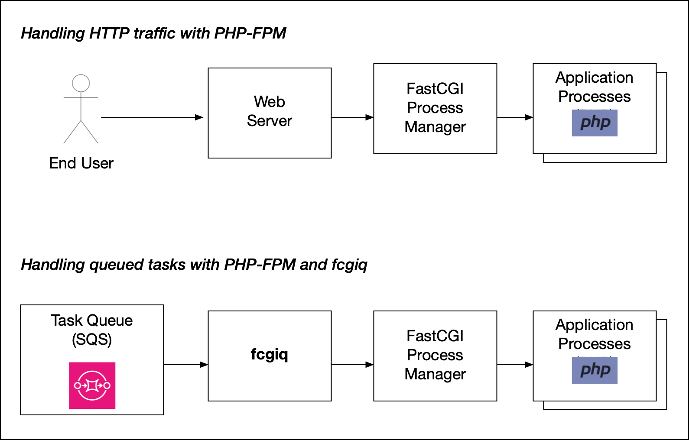

# fcgiq

A Simple Queue Service (SQS) client which distributes work to a FastCGI pool.

Fcgiq lets you take advantage of the worker pool functionality of FastCGI-compatible application stacks, such as PHP,
and utilise this when implementing a task queue.



## Why is FastCGI a good way to distribute asynchronous tasks to a PHP application?

1. The PHP runtime is optimized for short-term invocations. You can write a long-running worker in PHP, 
   but arguably the engine doesn't receive the same degree of testing and scrutiny for this less-common use case.
   * With fcgiq, a PHP process handles a single task and then resets, just like a web request.
2. If you do write a long-running worker in PHP, your choices are:
   * Execute tasks one at a time (need to run multiple workers if you want any concurrency, and you'll probably need a
     third-party tool to manage the workers)
   * Use a third-party async library (not core functionality, not compatible with all frameworks)
   * Invoke a child PHP process to handle each task (re-inventing the wheel - it's what FastCGI is built for)
3. The PHP-FPM (FastCGI Process Manager) is a rock-solid, battle-tested part of the PHP distribution, and is one of the
   most popular ways to connect PHP with a web server. It already contains functionality to:
   * Keep a pool of 'warm' PHP processes running and ready to receive requests for optimal performance
   * Allow the pool to grow during busy periods, then shrink back  to a minimum number when idle
   * Completely reset the PHP runtime's state between requests, ensuring isolation
   * Periodically replace child processes to guard against memory leaks in the PHP core or in extensions
   
## Usage

```
fcgiq [-c <config file path>]
```
By default, fcgiq looks for a file `config.yaml` in the current working directory.

## Configuration

fcgiq is configured using a YAML file.

```yaml
## Example config file ##

# Configure an SQS queue to receive tasks from.
queue:
  sqs:
    queue_url: https://sqs.us-east-1.amazonaws.com/177715257436/MyQueue/
    visibility_timeout: 300

# Configure a FastCGI Process Manager to distribute tasks to.
fastcgi:
  address: 127.0.0.1
  port: 9000
  script_path: /srv/app/task-handler.php
  max_parallel_requests: 10
  cgi_environment:
    # Default CGI environment variables. These can be overridden at the task level via the field_mappings section.
    CONTENT_TYPE: application/json
    DOCUMENT_ROOT: /srv/app
    REQUEST_METHOD: POST

# Map queue item fields to CGI environment variables.
field_mappings:
  REQUEST_URI:
    source: BodyJson
    field: job
  TRACE_ID:
    source: Metadata
    field: traceId

log_level: Info
```

### queue

The `queue` section lets you configure the queue to watch for tasks.

| Field                  | Description                                                                                                                                                                                                               |
|------------------------|---------------------------------------------------------------------------------------------------------------------------------------------------------------------------------------------------------------------------|
| sqs.queue_url          | Identifies the queue to watch for tasks. This corresponds to the `QueueUrl` field in the SQS `SendMessage` API call.                                                                                                      |
| sqs.visibility_timeout | The time (in seconds) to keep a task from being re-delivered once it is de-queued. See the [SQS Developer Guide](https://docs.aws.amazon.com/AWSSimpleQueueService/latest/SQSDeveloperGuide/sqs-visibility-timeout.html). |

**SQS API authentication note**: fcgiq embeds the AWS SDK, which means it accepts the same configuration mechanisms as the `aws` command-line tool. For a typical setup, you might need to set the `AWS_DEFAULT_REGION`,
`AWS_ACCESS_KEY_ID` and `AWS_SECRET_ACCESS_KEY` environment variables. See the [AWS CLI User Guide](https://docs.aws.amazon.com/cli/latest/userguide/cli-chap-configure.html).

### fastcgi

The `fastcgi` section lets you configure the FastCGI server to distribute tasks to.

| Field                 | Description                                                                                                                                                                                                                                                                            |
|-----------------------|----------------------------------------------------------------------------------------------------------------------------------------------------------------------------------------------------------------------------------------------------------------------------------------|
| address               | The hostname or IP address of the FastCGI Process Manager to distribute tasks to.                                                                                                                                                                                                      |
| port                  | The TCP port to use when connecting to the FastCGI Process Manager.                                                                                                                                                                                                                    |
| script_path           | The script to execute when handling a task. This file needs to exist on the machine running the FPM.                                                                                                                                                                                   |
| max_parallel_requests | Sets how many tasks fcgiq will allow to run simultaneously. Once this many tasks have been distributed to the FPM, fcgiq will stop watching the queue until a task finishes.                                                                                                           |
| cgi_environment       | A mapping of [CGI environment variables](https://datatracker.ietf.org/doc/html/rfc3875#section-4.1) to values. Here you can set static values that aren't task-specific. Every request dispatched to the FPM will use these values, unless overridden by the `field_mappings` section. |


### field_mappings

The `field_mappings` section lets you extract properties from your queue items and pass them when invoking your script.

Each key is a [CGI environment variable](https://datatracker.ietf.org/doc/html/rfc3875#section-4.1), and its value is an object with `source` and `field` which will determine the value of that variable.

`source` must be one of:
* `BodyJson` - Interpret the body of the queue item as a JSON object, and extract the value of the specified property, if present.
* `Metadata` - Extract the value of an SQS [Message Attribute or Message System Attribute](https://docs.aws.amazon.com/AWSSimpleQueueService/latest/SQSDeveloperGuide/sqs-message-metadata.html).

`field` is the name of the JSON property or message attribute to extract.

#### Example
Your application might submit an item to the queue with a body that looks like this:
```json
{"job": "/process-upload/55492", "userId": 9874}
```
When this item is handled, you may want the value of `"job"` made available to your PHP script as
`$_SERVER['REQUEST_URI']` so you can take advantage of your framework's URL routing middleware. In that case, you would configure `field_mappings` like this:

```yaml
field_mappings:
  REQUEST_URI:
    source: BodyJson
    field: job
```

Note that, regardless of any mapping configuration, fcgiq always submits the whole body payload of the queue item to your script as the **HTTP request body**.

### log_level

The `log_level` field determines the verbosity of log output that fcgiq sends to STDOUT.

This can be one of `Error`, `Warn`, `Info`, `Debug`, `Trace` (ordered from least to most verbose). The default level is `Info`.


## General recommendations

#### Don't use the same FPM pool to handle both HTTP requests and queue tasks.
With separate pools you can configure different FPM options and limits, and queue tasks won't have to compete with
website visitors for execution slots.

####  You can run multiple instances of fcgiq.
You might run multiple instances:
* On different machines, listening on the same queue, for load balancing or HA purposes (SQS inherently supports multiple consumers and atomic message delivery).
* Listening on different queues, with different configuration. e.g. A high priority and a normal priority queue.

#### It's best if each instance of fcgiq is attached to its own dedicated FPM.
fcgiq has no way of knowing how many execution slots are currently available, so it's better if it has dedicated
access to a pool, and has its `max_parallel_requests` set to match the pool's `max_children`. Otherwise, it may
de-queue a task and then be unable to dispatch it. This is especially unhelpful if you are planning to run multiple instances
of fcgiq which share a queue. Once the overloaded instance has de-queued a task, another instance (which may have spare capacity)
will no longer be able to see it.

#### Run fcgiq on the same machine as the FPM, connecting to it on `localhost`.
FastCGI is intended as a local protocol. It has no security features. In a containerised environment, either run fcgiq in the same container with php-fpm, or in a sidecar.
You should definitely *never* expose your FPM to the public internet.
